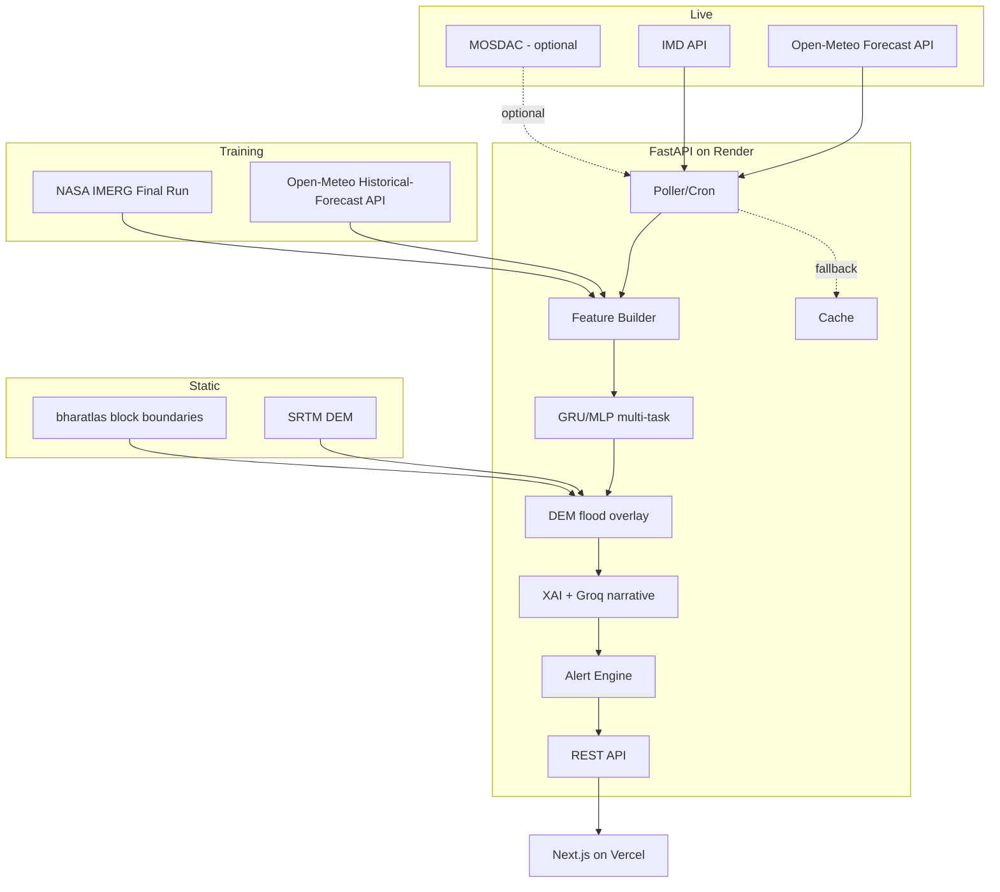

# Architecture & Tech Stack

## The one architecture decision that matters most

The PS implies a ConvLSTM/spatiotemporal-transformer over aligned satellite/reanalysis grids. That
needs perfectly-aligned multi-source raster sequences — exactly the slow, manual, multi-terabyte
IMDAA/MOSDAC/INSAT alignment work that every feasibility pass flagged as the top risk. Meghdoot
instead uses a **per-block time-series GRU/MLP over tabular features**, sourced entirely from
Open-Meteo's identical live/historical schema. Same three physical input categories
(moisture/instability/lift), same multi-task shared-backbone-plus-heads structure — only the
spatial representation changed. State this trade-off plainly to judges.

## System diagram

## Live vs training — the schema-consistency rule (single most important decision, keep this)

Live inference uses `api.open-meteo.com/v1/forecast`. Training data uses
`archive-api.open-meteo.com` **Historical Forecast API** (not raw ERA5 — raw ERA5 has ~5-day
latency and was dropped entirely from this project). Historical Forecast API uses the *same
models, params, units, format* as live, coverage from 2021+. One code path parses both — this is
what removes the train/inference drift risk that sank the original ConvLSTM plan.

## Components

| Component | Job |
|---|---|
| Poller/Cron | Open-Meteo + IMD every 15–30min, writes `weather_snapshots`, falls back to cache |
| Feature Builder | CAPE/CIN direct + derived convergence (`-metpy.calc.divergence`)/shear/IWV-proxy per block/timestep |
| Model | GRU/MLP, last 6 timesteps → 3 head probabilities |
| DEM overlay | `pysheds` flow accumulation × rain-intensity head → block flash-flood risk |
| XAI | SHAP-lite/gradient×input → Groq → plain-English narrative, cached once per alert |
| Alert Engine | Threshold crossing → new alert row, cross-checks IMD warning if available |
| Fallback Cache | Last-known-good per source, `data_mode` field (`live`/`cached_fallback`/`replay`) always visible to frontend |
| Replay mode | Reads pre-baked `replay_events` table, **zero live calls** — the demo's hard floor |

## Tech stack — all free tier, no card required anywhere

| Layer | Service | Notes |
|---|---|---|
| Frontend hosting | Vercel (Hobby) | 100GB/mo bandwidth |
| Backend hosting | Render (free web service) | Sleeps after 15min idle — needs UptimeRobot ping before demos |
| Database | Neon Postgres | 0.5GB free, use from Day 1 (not "hosting") |
| XAI narrative | Groq API | Fast/small Llama-class model, short-text task |
| Cron | GitHub Actions or Render's own cron | Either works, test both at deploy time |
| Keep-alive | UptimeRobot | 5-min ping, free |
| Map tiles | OpenStreetMap/Leaflet | Free, attribution required |
| ML training | Google Colab free T4 | Model is small enough CPU may suffice |
| Model weights | Committed to git repo | Small (few MB), no external hosting needed |

Local deps: `fastapi uvicorn sqlalchemy psycopg2-binary pandas numpy xarray requests scikit-learn
torch metpy geopandas rasterio pysheds python-dotenv groq h5py netCDF4`. Frontend: `next react
leaflet react-leaflet tailwindcss`.
