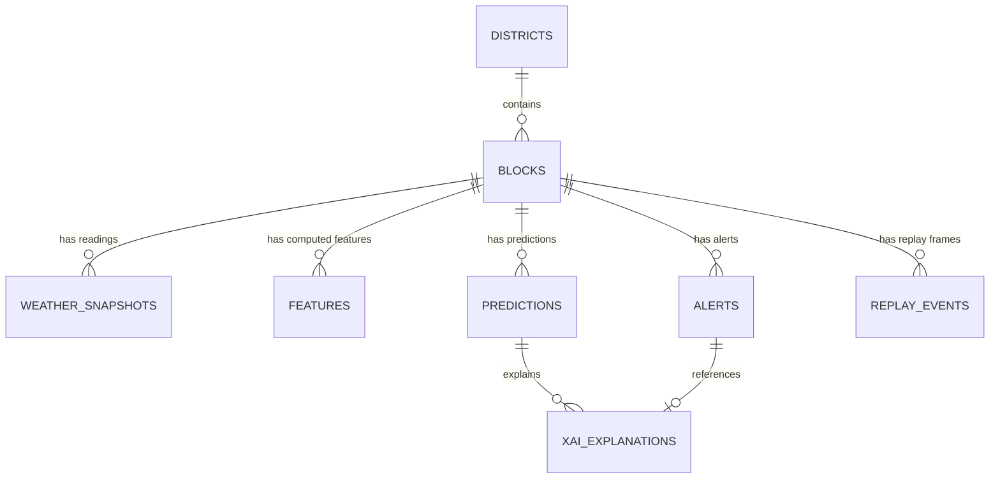

# Database Schema — Neon Postgres

Neon is used from Day 1 (it's a database service, not "hosting the app" — see `00_START_HERE.md`'s
one rule). Connect locally with the same connection string that production will eventually use, so
there is never a schema migration surprise on deployment day.

## Entity overview



## DDL

```sql
-- Districts (from IMD district list, Obj_id resolved Phase 1)
CREATE TABLE districts (
    id          SERIAL PRIMARY KEY,
    name        TEXT NOT NULL,
    state       TEXT NOT NULL,          -- 'Punjab' | 'Haryana' | 'Delhi'
    imd_obj_id  TEXT,                    -- nullable until resolved
    created_at  TIMESTAMPTZ DEFAULT now()
);

-- Blocks (from bharatlas LGD boundaries, filtered to region)
CREATE TABLE blocks (
    id             SERIAL PRIMARY KEY,
    district_id    INTEGER REFERENCES districts(id),
    lgd_code       TEXT UNIQUE,          -- Local Government Directory code
    name           TEXT NOT NULL,
    centroid_lat   DOUBLE PRECISION NOT NULL,
    centroid_lon   DOUBLE PRECISION NOT NULL,
    geometry_geojson JSONB NOT NULL,     -- block polygon
    created_at     TIMESTAMPTZ DEFAULT now()
);

-- Raw poller output, one row per external call
CREATE TABLE weather_snapshots (
    id           BIGSERIAL PRIMARY KEY,
    block_id     INTEGER REFERENCES blocks(id),
    source       TEXT NOT NULL,          -- 'open-meteo' | 'imd' | 'mosdac'
    fetched_at   TIMESTAMPTZ NOT NULL,
    raw_response JSONB NOT NULL,
    is_fallback_cache BOOLEAN DEFAULT false,  -- true if served from cache, not a live hit
    UNIQUE (block_id, source, fetched_at)
);

-- Derived feature row, one per block per timestep — the model's actual input
CREATE TABLE features (
    id              BIGSERIAL PRIMARY KEY,
    block_id        INTEGER REFERENCES blocks(id),
    ts              TIMESTAMPTZ NOT NULL,
    cape            DOUBLE PRECISION,
    cin             DOUBLE PRECISION,
    iwv_proxy       DOUBLE PRECISION,
    ctt_drop_rate   DOUBLE PRECISION,
    ctt_is_proxy    BOOLEAN DEFAULT true,  -- false only if real MOSDAC CTT was used
    convergence_850 DOUBLE PRECISION,
    wind_shear      DOUBLE PRECISION,
    rainfall_recent DOUBLE PRECISION,
    UNIQUE (block_id, ts)
);

-- Model output
CREATE TABLE predictions (
    id                  BIGSERIAL PRIMARY KEY,
    block_id            INTEGER REFERENCES blocks(id),
    ts                  TIMESTAMPTZ NOT NULL,
    horizon_hours        SMALLINT NOT NULL,     -- 2..6
    p_thunderstorm       REAL,
    p_cloudburst         REAL,
    rain_intensity_head  REAL,                  -- feeds the DEM flood overlay
    flash_flood_risk     REAL,                  -- computed post-DEM-overlay
    model_version        TEXT NOT NULL,
    is_baseline_heuristic BOOLEAN DEFAULT false, -- true if the fallback formula, not the trained model
    UNIQUE (block_id, ts, horizon_hours)
);

-- Alerts — only written when a threshold is newly crossed, not every poll
CREATE TABLE alerts (
    id                BIGSERIAL PRIMARY KEY,
    block_id          INTEGER REFERENCES blocks(id),
    prediction_id     BIGINT REFERENCES predictions(id),
    hazard            TEXT NOT NULL,     -- 'thunderstorm' | 'cloudburst' | 'flash_flood'
    severity          TEXT NOT NULL,     -- 'Yellow' | 'Orange' | 'Red', mirroring IMD's own coding
    imd_cross_check    TEXT,              -- IMD's own color if available, else NULL
    onset_estimate    TIMESTAMPTZ,
    created_at        TIMESTAMPTZ DEFAULT now(),
    resolved_at       TIMESTAMPTZ
);

-- Plain-English XAI explanation, generated once per alert, cached forever
CREATE TABLE xai_explanations (
    id            BIGSERIAL PRIMARY KEY,
    alert_id      BIGINT REFERENCES alerts(id) UNIQUE,
    top_features  JSONB NOT NULL,        -- [{feature: 'cape', contribution: 0.41}, ...]
    narrative     TEXT NOT NULL,          -- Groq-generated plain English
    generated_at  TIMESTAMPTZ DEFAULT now()
);

-- Pre-baked replay dataset — built once in Phase 2, read-only at demo time, zero live calls
CREATE TABLE replay_events (
    id            BIGSERIAL PRIMARY KEY,
    event_name    TEXT NOT NULL,          -- 'aug_2025_punjab_floods' | 'jul_2023_north_india_floods'
    block_id      INTEGER REFERENCES blocks(id),
    ts            TIMESTAMPTZ NOT NULL,
    frame_index   INTEGER NOT NULL,       -- sequential playback order
    p_thunderstorm REAL,
    p_cloudburst   REAL,
    flash_flood_risk REAL,
    narrative     TEXT
);

-- Health log for the Data Status page — one row per poll attempt per source
CREATE TABLE api_health_log (
    id          BIGSERIAL PRIMARY KEY,
    source      TEXT NOT NULL,
    checked_at  TIMESTAMPTZ DEFAULT now(),
    success     BOOLEAN NOT NULL,
    latency_ms  INTEGER,
    error_note  TEXT
);
```

## Indexing notes

- `features(block_id, ts)` and `predictions(block_id, ts)` should have composite indexes — the
  dashboard's "last 6 timesteps per block" query runs constantly.
- `alerts(resolved_at)` partial index (`WHERE resolved_at IS NULL`) for the active-alerts feed.

## Migration approach

Use a lightweight migration tool (Alembic, if the backend is FastAPI+SQLAlchemy) from the very
first commit — even in local dev — so that "run migrations" is a single documented command that
works identically locally and against production Neon on deployment day.
