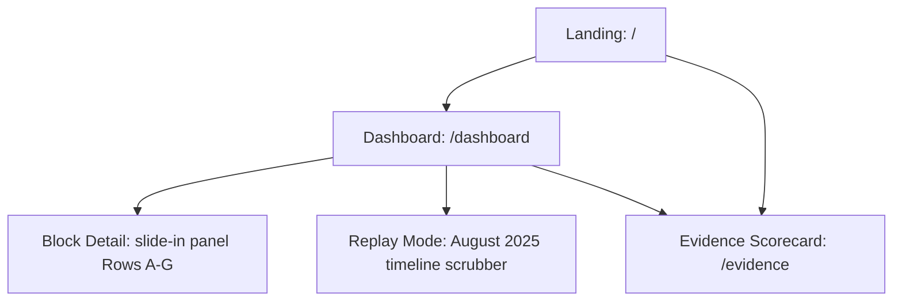

# Frontend — Pages, Flows, Design System

## Stack & Architecture

- **Engine**: Vite + React 19 + TypeScript
- **Styling**: Tailwind CSS with custom dual token palette (`brand.*` for Landing, `radar.*` for Dashboard)
- **Mapping**: Leaflet + `react-leaflet` with Carto dark basemap

## Site Map & Routes (`src/App.tsx`)



## Implemented Pages

- **Landing (`/`)** — full-viewport video hero, mission narrative, atmospheric triad hazard heads, live telemetry scenario console, full architecture diagram, and live Bihar river basin telemetry monitor with radar sweep animation.
- **Dashboard (`/dashboard`)** — full-bleed Leaflet map displaying 12 monitored blocks, colored by active hazard layer (Thunderstorm / Cloudburst / Flash Flood). Mode toggle (**LIVE** vs. **REPLAY: August 2025** with time-scrubber). Ticking live timestamp.
- **Block Detail Panel** (slide-in panel on `/dashboard`) — Rows A–G:
  - Row A: Block name, river basin, top hazard, dry-sky badge
  - Row B: Upstream catchment telemetry (3h rainfall)
  - Row C: Estimated arrival countdown & window
  - Row D: Runoff contribution split bar
  - Row E: Vulnerable exposure register (people, schools, health centers)
  - Row F: 3-row comparison block (forecast rain, threshold alert, Meghdoot lead time)
  - Row G: Meteorological XAI narrative (Groq LLM + physical fallback)
- **Evidence Scorecard (`/evidence`)** — static lead-time scorecard rendering `leadtime.json` over the August 2025 Punjab flood reconstruction. Demonstrates verified lead-time gains (e.g. +3h 40m for Rupnagar) with honest zero/negative entries for un-impacted blocks. Operates completely offline.

## User Flows

**Officer**: Landing → Dashboard → clicks Orange block → checks arrival clock + upstream inflow → reviews vulnerable exposure counts → coordinates evacuation.
**Judge**: Landing (the thesis) → Dashboard (live badge + dry-sky flood demo) → clicks block (XAI + kinematic routing) → Replay mode with wifi off (offline resilience) → `/evidence` scorecard (receipts).


---

## Design system (applies app-wide)

**Concept**: weather-radar console meets monsoon sky — dark by default, map-first, data-dense but
uncluttered. Not a generic SaaS template.

**Colors** — severity scale deliberately mirrors IMD's own official coding so it's instantly
recognizable: Green `#3DBA6D` / Yellow `#E8C547` / Orange `#E8873D` / Red `#D4483D`.
Base: bg `#0B1220`, surface `#121B2E`, raised `#1A2740`, border `#25314A`, text `#E8EDF7`/`#8B9BB8`,
accent `#5FA8D3`.

**Type**: Inter/Manrope for UI; JetBrains Mono/IBM Plex Mono for numeric readouts (signals "real
measurement"). Titles 24–28px semibold, body 13–14px.

**Map**: dark/muted basemap (CARTO dark-matter or similar) so risk-colored polygons dominate.
Fill ~55% opacity + 1.5px border, hover raises to ~75%. Active alerts get a slow 2–3s pulse — the
only animated element on the Dashboard, so it draws the eye without noise.

**Layout**: floating control panels never exceed ~15% viewport width — map stays dominant. Cards:
12px radius, `--bg-surface` fill, no heavy shadows (rely on dark-bg contrast instead).

**Icons**: Lucide (free), monochrome, colored only by severity token — never a rainbow of icon colors.

**Tone**: confident/technical, not alarmist — severity color carries the emotional signal, copy
stays plain and factual ("Cloudburst risk: elevated, driven by rapid CAPE buildup").

**Responsive**: must work on laptop (primary demo surface) and not visibly break on phone browser.
No native app.

---

## LANDING PAGE — FULL SPEC

Structural pattern: fixed translucent navbar + full-viewport video hero, followed by comprehensive
technical, scientific, and humanitarian operational sections (Mission, Atmospheric Triad, Real-Time
Telemetry & XAI, 5-Stage Architecture Pipeline, Field Impact on frontline responders, Verification
Standards, and an extensive Technical Footer). Applied strictly to Meghdoot's dark radar-console
palette (#0A0A0A base) with clear, positive, and humane exposition.

### Stack
React + TypeScript + Vite · Tailwind CSS · `lucide-react` icons: `Radar`, `ChevronDown`,
`ArrowRight`, `Menu`, `X` · Single `App.tsx` composed of `Navbar` + `Hero` (hero contains the
pitch, the live stat strip, and the CTA — no separate section components needed).

### Background video
Full-bleed looping video of monsoon storm clouds building/moving — time-lapse cumulonimbus
development or a satellite loop reads best given the subject matter. Placeholder asset until the
team sources or renders real footage:
```
https://d8j0ntlcm91z4.cloudfront.net/user_38xzZboKViGWJOttwIXH07lWA1P/hf_20260820_010308_b1636845-4c15-4ab6-b0c9-9a29bfb0c6e3.mp4
```
Swap this for real storm/monsoon footage as soon as it's available — sourcing this is a Phase 3
polish task, not a blocker for building the page now.

### Fonts (in `index.html`)
```html
<link href="https://fonts.googleapis.com/css2?family=Inter:wght@400;500;600;700&family=Manrope:wght@500;600;700&family=JetBrains+Mono:wght@400;500&display=swap" rel="stylesheet">
```

### Page title
`Meghdoot — Hyper-Local Severe Weather Early Warning`

### Design Philosophy
The tone is: **quiet, technical, credible** — a real instrument panel, not a marketing pitch. It uses a sleek neutral dark palette (#0A0A0A base) with warm amber and red accents, paired with clear, positive, and humane exposition.

### Visual Overhaul Requirements (Completed)
- **Glass-morphic Cards**: `backdrop-blur-xl`, `bg-gradient-to-b`, and grain textures.
- **Cinematic Motion**: Staggered entrances and scroll-triggered reveals using `framer-motion`.
- **Live Status Feed**: Active pulsing badges and real-time UTC clock.
- **Warm Color Palette**: Removal of all blues/cyans. Use of pure blacks (`#0A0A0A`), warm ambers (`#F59E0B`), and vibrant mesh gradients.
- **Animated Components**: `NumberTicker`, `RadarSweep`, and `TiltCard`.

### Color tokens (Tailwind `theme.extend.colors.brand`)
- **Backgrounds**: `bg` (#0A0A0A), `surface` (#171717), `raised` (#262626)
- **Borders & UI**: `border` (#404040), `glow` (rgba(245, 158, 11, 0.15))
- **Typography**: `text` (#F5F5F5), `subtext` (#A3A3A3)
- **Severity/Status (The "Dashboard" scales)**: `green` (#10B981 - normal), `yellow` (#F59E0B - watch), `orange` (#F97316 - elevated), `red` (#EF4444 - severe)
- **Accents**: Warm amber and reds replacing cyan and blue.
```
sans: "Inter", "Manrope", system-ui, sans-serif
mono: "JetBrains Mono", "IBM Plex Mono", monospace
```

### Global CSS
Body: `font-family: 'Inter', system-ui, sans-serif;` with antialiasing.
`* { margin:0; padding:0; box-sizing:border-box; }`. `html { scroll-behavior: smooth; }`.
Root app wrapper: `font-sans`. Background of the hero section: `bg-brand-bg` (`#0B1220`).

### Animations (global CSS, exact)
```css
@keyframes fade-up {
  from { opacity: 0; transform: translateY(20px); }
  to   { opacity: 1; transform: translateY(0); }
}
@keyframes fade-down {
  from { opacity: 0; transform: translateY(-12px); }
  to   { opacity: 1; transform: translateY(0); }
}
@keyframes pulse-dot {
  0%, 100% { opacity: 1; }
  50%      { opacity: 0.35; }
}
.animate-fade-up   { animation: fade-up 0.8s cubic-bezier(0.16, 1, 0.3, 1) both; }
.animate-fade-down { animation: fade-down 0.7s cubic-bezier(0.16, 1, 0.3, 1) both; }
.animate-pulse-dot { animation: pulse-dot 2.4s ease-in-out infinite; }
.stagger-1 { animation-delay: 0ms; }
.stagger-2 { animation-delay: 120ms; }
.stagger-3 { animation-delay: 240ms; }
.stagger-4 { animation-delay: 360ms; }
.stagger-5 { animation-delay: 480ms; }
```
The pulse is used in exactly one place: the "live" status dot in the announcement pill. This is
the same animation language as the Dashboard's active-alert pulse — one consistent motion idea
across the whole product, not a new decorative effect invented for the landing page.

---

### 1) Navbar

Fixed `top-0 left-0 right-0 z-50`. Transition `duration-300`.
- If `window.scrollY > 20`: `bg-brand-bg/90 backdrop-blur-md border-b border-brand-border`
- Else: `bg-transparent`

Inner container: `max-w-7xl mx-auto px-6 lg:px-8`. Bar: `relative flex items-center h-16 md:h-20`.

**Left logo mark** (not centered — left-aligned, matching the data-console feel of the rest of
the product):
`flex items-center gap-2 animate-fade-down stagger-1`
- Lucide `Radar` icon: `w-5 h-5 text-brand-accent`
- Text "Meghdoot": `text-lg text-brand-text tracking-tight font-semibold font-sans`

**Center nav links** (`hidden md:flex items-center gap-8 absolute left-1/2 -translate-x-1/2`,
`animate-fade-down stagger-2`):
All: `text-sm text-brand-subtext hover:text-brand-text transition-colors`
- Anchor: `Dashboard`
- Anchor: `About`
- Anchor: `Status`

**Right CTA** (`hidden md:inline-flex items-center ml-auto`, `animate-fade-down stagger-3`):
`px-5 py-2.5 bg-brand-accent text-brand-bg text-sm font-medium rounded-full hover:brightness-110 transition-all`
Label: **Open Dashboard**

**Mobile hamburger** (`md:hidden ml-auto z-50 w-10 h-10`, `aria-label="Toggle menu"`):
Lucide `Menu` / `X` icon swap, `text-brand-text`, `transition-transform duration-300`.

**Mobile overlay** (`md:hidden fixed inset-0 bg-brand-bg z-40`):
Transition `duration-500 ease-[cubic-bezier(0.22,1,0.36,1)]`.
- Open: `opacity-100 pointer-events-auto`
- Closed: `opacity-0 pointer-events-none`

Inner column: `flex flex-col items-center justify-center h-full gap-8`, same 500ms ease, `delay-100`.
- Open: `translate-y-0 opacity-100`
- Closed: `-translate-y-8 opacity-0`

Links (each `text-3xl text-brand-text tracking-tight`): Dashboard, About, Status.
CTA: `mt-4 inline-flex items-center px-8 py-3.5 bg-brand-accent text-brand-bg text-lg rounded-full`
→ **Open Dashboard**. Clicking any item closes the menu. Lock `document.body.style.overflow = 'hidden'` while open.

No dropdown panels. Every nav item is a direct link.

---

### 2) Hero

`section.relative.w-full.h-screen.min-h-[700px].overflow-hidden.bg-brand-bg`

**Video layer**: `div.absolute.inset-0` wrapping `<video>`:
- `src` = the placeholder URL above
- `autoPlay muted loop playsInline`
- class: `w-full h-full object-cover object-center`

**Scrim** (functional, not decorative — storm footage plus light UI text needs this for
legibility, unlike a bright daytime template): `absolute inset-0 bg-gradient-to-t from-brand-bg via-brand-bg/40 to-brand-bg/10`.
This keeps the video visible at the top of frame and readable at the bottom where the text sits.

**Content column** (left-aligned, not vertically centered — mirrors the Dashboard's own
data-console alignment):
`relative z-10 flex flex-col items-start max-w-7xl mx-auto pt-32 md:pt-40 px-6 lg:px-8 h-full`

**Announcement pill**
`inline-flex items-center gap-2.5 px-4 py-2 rounded-full border border-brand-border bg-brand-surface/70 backdrop-blur-sm mb-6 animate-fade-up stagger-3`
- A small dot: `w-1.5 h-1.5 rounded-full bg-brand-green animate-pulse-dot`
- Text (`text-sm text-brand-subtext`): **Live monitoring active across Punjab, Haryana & Delhi**

**Headline**
`h1` classes: `text-left text-3xl sm:text-4xl md:text-5xl lg:text-6xl text-brand-text leading-[1.1] tracking-tight max-w-3xl font-semibold font-sans animate-fade-up stagger-4`

Exact copy, line break only from `sm` and up:
```
Severe weather, seen
hours before it arrives
```
Implementation: first line, then `<br className="hidden sm:block" />`, then a space, then
"hours before it arrives". Under 640px it wraps naturally as one block.

**Subline**
`p` classes: `text-left text-base md:text-lg text-brand-subtext max-w-xl mt-5 leading-relaxed animate-fade-up stagger-5`

Exact copy:
```
Meghdoot tracks the atmospheric signals that come before thunderstorms, cloudbursts, and
flash floods — giving disaster teams a two-to-six-hour head start, block by block, across India.
```

**CTA**
`div.mt-8.animate-fade-up.stagger-5` wrapping a single anchor button:
`inline-flex items-center gap-2 px-7 py-3.5 bg-brand-accent text-brand-bg text-base font-medium rounded-full hover:brightness-110 transition-all`
Label: **Open the live dashboard**, with a Lucide `ArrowRight` icon `w-4 h-4`.

No second button. One clear action.

---

### 3) Live stat strip (inside Hero, under the CTA)

This replaces a "trusted by" logo row with something more honest to the subject: real numbers
about what the system actually does, set in the monospace face that the rest of the product uses
for real measurements — so a visitor's first impression matches the Dashboard's own visual language.

Wrapper: `w-full mt-12 md:mt-16 pb-16 animate-fade-up stagger-5`
Row: `flex flex-wrap items-start gap-x-10 gap-y-6`

Four stat blocks, each `flex flex-col gap-1`:
- Number: `text-2xl md:text-3xl font-mono text-brand-text`
- Label: `text-xs text-brand-subtext mt-1 max-w-[10rem] leading-snug`

| Number | Label |
|---|---|
| `2–6 hrs` | Lead time before severe weather onset |
| `15 min` | How often live conditions are refreshed |
| `3` | Hazards tracked at once — storms, cloudbursts, floods |
| `All India` | Map coverage, growing from a validated North India core |

---

### Responsive rules (must match)

- `< md` (768px): hamburger + full-screen dark overlay menu; hide desktop nav links and CTA;
  nav height `h-16`; hero padding `pt-32 px-6`; stat strip wraps to two columns; headline `text-3xl` then `sm:text-4xl`.
- `md+`: nav links centered, logo left, CTA right; nav `h-20`; hero `pt-40`; stat strip in one row.
- `lg+`: container `px-8`; headline `lg:text-6xl`.
- Hero always `h-screen` with `min-h-[700px]`.
- Content always left-aligned (`items-start`, `text-left`, `justify-start`).
- Video always `object-cover object-center`.

### Visual character

Quiet, technical, credible — a live instrument panel, not a marketing pitch. Dark radar-console
palette carried straight from the Dashboard, so the very first screen a visitor sees already
looks like the product they're about to use. One pulsing live-dot as the sole animated accent,
echoing the same pulse language used for active alerts inside the app. Numbers set in monospace
because that's this product's way of signaling "this is a real measurement, not marketing copy."
Entrance choreography: nav fades down first (0 / 120 / 240ms), then pill, headline, subline, CTA,
and stat strip fade up in sequence (240 / 360 / 480ms) — one deliberate reveal, nothing scattered.

### 4) Extensive Operational & Scientific Sections (Appended to Landing Page)

1. **Humanitarian Mission (`#mission`)**:
   - The critical 2–6 hour horizon: explaining why traditional NWP compute cycles benefit from rapid 15-min neural nowcasting.
   - Inspiration from Kalidasa's *Meghdūta* ("The Cloud Messenger") — transforming clouds into messengers of proactive protection.
   - Core pillars: Protecting vulnerable habitats and preserving civic/agricultural livelihoods.
   - SIH26077 / MoES & NCMRWF institutional alignment.

2. **Atmospheric Triad Hazard Heads (`#hazards`)**:
   - Interactive tabbed component detailing the 3 dedicated multi-task prediction heads:
     - **Severe Thunderstorms**: CAPE (>2,200 J/kg), CIN collapse, 850–500 hPa vertical shear. Lead time: 3–6 hrs.
     - **Localized Cloudbursts**: Extreme IWV moisture convergence and steep CTT cooling. Lead time: 2–4 hrs.
     - **Terrain-Coupled Flash Floods**: SRTM DEM slope vectors × pysheds flow accumulation. Lead time: 2–5 hrs.

3. **Real-Time Instrument Panel & Explainable AI (`#telemetry`)**:
   - Interactive live block telemetry widget with 3 selectable operational scenarios:
     - Scenario A: Stable Atmospheric State (Chandigarh Urban Block).
     - Scenario B: Pre-Convective Buildup (Rupnagar Block, Punjab — Orange Watch).
     - Scenario C: Critical Surge Imminent (Yamunanagar Basin, Haryana — Red Warning).
   - Real metrics displayed: CAPE, CIN, 850 hPa Convergence (s⁻¹), Integrated Moisture Saturation (%), Terrain Hydro Index.
   - Human-in-the-Loop Explainable AI Narrative: plain-English physical attribution powered by SHAP saliency + Groq synthesis.

4. **End-to-End System Architecture (`#architecture`)**:
   - 5-stage pipeline: (1) Unified Multi-Stream Ingestion → (2) Physical Feature Engineering → (3) Multi-Task Neural Encoder → (4) Topographic Runoff Coupling → (5) Explainable AI & Alert Dispatch.
   - Field-Ready Resilience Card: Highlighting zero-internet offline replay (Aug 2025 Punjab & Jul 2023 North India events) ensuring life-safety reliability during network outages.

5. **Frontline Field Impact (`#impact`)**:
   - Dedicated workflows for District Disaster Management Authorities (DDMA), Municipal Water Engineers, Agricultural Communities, and NDRF/SDRF emergency rescue units.

6. **Standards, Open Science & Technical Footer**:
   - Alignment with official IMD color coding (Green, Yellow, Orange, Red) and NASA IMERG ground-truth verification.
   - Extensive technical footer with system health status badge (`All Systems Nominal`), subsystem links, and data source attributions.
